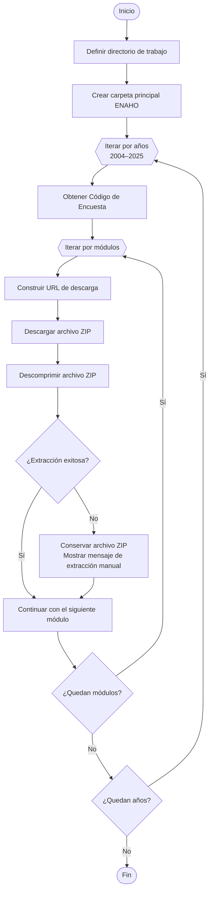

Script automatizado en Stata para descargar, organizar y extraer los módulos de la Encuesta Nacional de Hogares (ENAHO) del portal de [Microdatos](https://proyectos.inei.gob.pe/microdatos/) del INEI (2004–2025). Incluye gestión de módulos, extracción de archivos ZIP y una estructura reproducible para facilitar el procesamiento de datos.

<!--more-->

1. Abrir el archivo 
```bash
Download-ENAHO-2004-2025.do
```

2. Modificar la ruta donde se almacenarán los archivos descargados.
```stata
global Path = "E:\07. GitHub\01-Web-Scraping-ENAHO-2004-2025"
```

3. Si lo deseas, modificar el rango de años:
```stata
local y_start = 4
local y_end   = 25
```

4. Seleccionar los módulos que deseas descargar:
```stata
foreach j in 1 2 3 4 5 {
```

5. Ejecutar el script.

## 3. Módulos disponibles <a id="3"></a>

| **Nro.** | **Módulo** | **Descripción** |
|---:|---|---|
| 1 | Módulo 1 | Características de la Vivienda y del Hogar |
| 2 | Módulo 2 | Características de los Miembros del Hogar |
| 3 | Módulo 3 | Educación |
| 4 | Módulo 4 | Salud |
| 5 | Módulo 5 | Empleo e Ingresos |
| 6 | Módulo 7 | Gastos en Alimentos y Bebidas |
| 7 | Módulo 8 | Instituciones Benéficas |
| 8 | Módulo 9 | Mantenimiento de la Vivienda |
| 9 | Módulo 10 | Transportes y Comunicaciones |
| 10 | Módulo 11 | Servicios de la Vivienda |
| 11 | Módulo 12 | Esparcimiento, Diversión y Servicios Culturales |
| 12 | Módulo 13 | Vestido y Calzado |
| 13 | Módulo 15 | Gastos de Transferencias |
| 14 | Módulo 16 | Muebles y Enseres |
| 15 | Módulo 17 | Otros Bienes y Servicios |
| 16 | Módulo 18 | Equipamiento del Hogar |
| 17 | Módulo 22 | Producción Agrícola |
| 18 | Módulo 23 | Subproductos Agrícolas |
| 19 | Módulo 24 | Producción Forestal |
| 20 | Módulo 25 | Gastos en Actividades Agrícolas y/o Forestales |
| 21 | Módulo 26 | Producción Pecuaria |
| 22 | Módulo 27 | Subproductos Pecuarios |
| 23 | Módulo 28 | Gastos en Actividades Pecuarias |
| 24 | Módulo 34 | Variables Calculadas (Resumen) |
| 25 | Módulo 37 | Programas Sociales |
| 26 | Módulo 77 | Ingresos del Trabajador Independiente |
| 27 | Módulo 78 | Bienes y Servicios para el Cuidado Personal |
| 28 | Módulo 84 | Participación Ciudadana |
| 29 | Módulo 85 | Gobernabilidad, Democracia y Transparencia |
| 30 | Módulo 1825 | Beneficiarios de Instituciones sin fines de lucro: Olla Común |
| 31 | Módulo 2081 | Crianza de Mascotas en el Hogar |
| 32 | Módulo 2082 | Inseguridad Alimentaria |

## 4. Funcionamiento del script <a id="4"></a>
El script realiza automáticamente las siguientes tareas:

1. Crea la estructura de carpetas del proyecto.
2. Recorre los años seleccionados.
3. Obtiene el Código de Encuesta correspondiente a cada año.
4. Recorre los módulos seleccionados.
5. Descarga cada archivo ZIP desde el portal oficial del INEI.
6. Descomprime automáticamente cada archivo.
7. Conserva el archivo ZIP cuando ocurre un error durante la extracción.

El proceso completo puede resumirse mediante el siguiente flujo:

El siguiente diagrama resume el flujo de ejecución del script para descargar y extraer automáticamente los módulos de la **Encuesta Nacional de Hogares (ENAHO)**:

# Flujo del proceso de descarga y extracción de la ENAHO (2004–2025)


*Elaboración propia.* <br>
***Nota:** El diagrama muestra el flujo de ejecución del script, incluyendo la iteración por años y módulos, la construcción de la URL de descarga, la obtención de los archivos desde el portal oficial del INEI y su extracción automática. En caso de que un archivo comprimido presente inconsistencias, el script conserva el archivo `.zip` y notifica al usuario que la extracción debe realizarse manualmente.*

## 5. Resultado 📂<a id="5"></a>
Al finalizar la ejecución se obtiene una estructura similar a la siguiente:

```text
ENAHO/
│
├── 2004/
│   ├── enaho01-2004.dta
│   ├── enaho02-2004.dta
│   └── ...
│
├── 2005/
│   └── ...
│
├── ...
│
└── 2025/
    └── ...
```
Cada carpeta contiene todos los módulos descargados y extraídos para el año correspondiente.

## 6. Observaciones ⚠️<a id="6"></a>
En algunos años, determinados archivos ZIP publicados por el INEI presentan inconsistencias que impiden su extracción automática mediante Stata.
Cuando esto ocurre, el script muestra un mensaje indicando que el archivo debe descomprimirse manualmente. El archivo ZIP descargado se conserva para facilitar este proceso.

## Licencia <a id="9"></a>
Este proyecto está licenciado bajo la Licencia MIT. Consulta el archivo [LICENSE](/LICENSE) para más detalles.

## Autor 👨‍💻<a id="10"></a>

**Carlos Eduardo Torres García**
[](https://www.linkedin.com/in/carlo4-eduardo-torres-garcia/)
[](https://x.com/Carlo4_Eduardo)

[**⬆ Volver al inicio**](#a)

# Bonus: still to solve

Don’t let anyone convince you they know everything. I still haven’t
managed to get my ideal (conditional on regular faceting with
`facet_wrap()` being out of the question) solution to this working. I
tried to create five subplots and just add a facet label to each, with
each one being a facet of one panel. Straightforward enough, right?

``` r
maps_facet <- map(.x = pko_countries, 
                  .f = function(x) adm %>% 
                    filter(NAME_0 == x) %>% 
                    st_join(acled) %>% 
                    group_by(NAME_0, NAME_1, NAME_2) %>% 
                    summarize(attacks = log1p(sum(!is.na(event_id_cnty)))) %>% 
                    ggplot(aes(fill = attacks)) +
                    geom_sf(lwd = NA) +
                    scale_fill_continuous(limits = attacks_range,
                                          name = 'PKO targeting\nevents (logged)') +
                    facet_wrap(~NAME_0) +
                    theme_rw() +
                    theme(axis.text = element_blank(),
                          axis.ticks = element_blank()))

plot_grid(plotlist = c(map(.x = maps_facet,
                           .f = function(x) x + theme(legend.position = 'none')),
                       list(get_legend(maps_facet[[1]]))),
          nrow = 2)
```


Not so much, and no amount of tinkering with the `align` and `axis`
arguments to `plot_grid()` has yielded any improvement. The specific
paper this plot is for doesn’t have any other plots with facets, so I’m
content to go with my inelegant solution of lettered labels and a key to
them in the figure caption. If that weren’t the case, I might still be
fiddling with this and getting deeper and deeper into the source code
for `plot_grid()`.

[^1]: If you’re wondering why the largest county area is in the ballpark
    of 0.25, it’s because the data are in [square
    degrees](https://en.wikipedia.org/wiki/Square_degree), an old non-SI
    unit of measurement that’s defined in terms of how much the field of
    view from a given point is obstructed by an object. GIS is so easy
    these days, folks.

[^2]: The more I learn about how `ggplot2` and `sf` work under the hood,
    the more amazed I am that `geom_sf()` Just Works in 80% of cases,
    let alone works at all.

[^3]: The answer also listed the `geom_spatial()` function from the
    `ggspatial` package as an alternative option, but I couldn’t get it
    to work. The answer is three and a half years old, which means it’s
    very possible something changed in either `sf` or `ggspatial` that
    broke this solution. So it goes.

[^4]: It’s much more powerful and easily customizable than
    `gridExtra::grid.arrange()`.

[^5]: They can also contain heterogeneous elements which will come in
    handy [later](#shared-legend).

[^6]: If you check out the actual source code of `plot_grid()`, line 9
    shows you that the function is indeed putting `...` ahead of
    `plotlist`: `plots <- c(list(...), plotlist)`.
